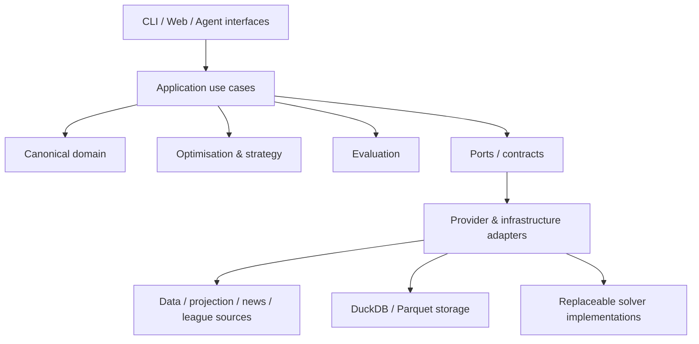

# Touchline

An open-source, local-first decision-support engine for Fantasy Premier League.

The project combines player projections, optimisation and multi-gameweek planning to support better
FPL decisions while keeping forecasting, strategy and decision logic independently replaceable.
Rival-aware strategy is a planned capability, not part of the current release.

> **Status:** v0.1.0 is the first operational local-first decision-engine baseline. It includes
> canonical domain/provider boundaries, offline ingestion and persistence, local projections,
> single- and multi-Gameweek optimisation, availability evidence, and reproducible GW1 decision
> capture. The remaining roadmap is still active; `main` remains the stable/releasable branch.

## Philosophy

> **Models forecast. Optimisers decide. Agents explain and interrogate.**

The engine deliberately separates four questions:

| Question | Layer |
| --- | --- |
| What might happen? | Forecast |
| What do I value? | Strategy |
| What action best satisfies that objective? | Optimiser |
| Why is that the recommendation? | Agent / interface |

This separation lets the same forecasts support different objectives later, such as maximising expected points, protecting a mini-league lead or deliberately seeking useful variance when chasing.

The project is a **decision-support system**, not an automatic transfer bot. Human approval remains outside the optimisation engine.

## Architecture

Dependencies point inward. External providers and open-source projects map into contracts owned by this repository; their schemas do not become the project's domain model.



The intended analytical flow is:

```text
Source evidence
    ↓
Provider adapters
    ↓
Canonical players / teams / fixtures / manager state
    +
Canonical projections
    ↓
Strategy objective
    ↓
Optimiser
    ↓
Recommendation
    ↓
Evaluation / explanation
```

### Architectural rules

- The domain layer has no HTTP, database, dataframe or LLM dependencies.
- Provider-specific identifiers are kept separate from stable internal identifiers.
- Provider capabilities, provenance, freshness and failures are explicit.
- External projects sit behind adapters; they do not dictate core types.
- Source evidence and decision runs are designed to be reproducible.
- LLM/agent components may explain or interrogate analytical outputs but do not perform hidden arithmetic or directly mutate forecasts.

Architecture decisions are recorded under [`docs/adr`](docs/adr).

## Implemented today

The project currently includes:

- Python 3.12 / `uv` project foundation;
- strict Ruff, Pyright and pytest CI;
- immutable canonical domain models for players, teams, gameweeks, fixtures, projections, squads, manager state, transfers, leagues and decision runs;
- core FPL invariants such as squad composition and club limits;
- provider contracts for core data, manager state, leagues, projections and news/evidence;
- replaceable optimisation-engine contracts;
- provider capability metadata, provenance/freshness envelopes and machine-readable error semantics;
- an offline-first immutable snapshot pipeline and FPL-shaped bootstrap/fixtures adapter;
- immutable canonical Parquet datasets with DuckDB catalogue, history/latest views and DecisionRun provenance;
- generic and FPL Forecast-shaped local CSV projection adapters with exact external-ID resolution;
- a direct-HiGHS single-gameweek optimiser for legal squad, XI, captain, vice-captain and ordered
  bench selection with bounded scenario constraints;
- deterministic local manager-state ingestion with manager-specific purchase and selling prices;
- single-Gameweek transfer optimisation with a comparable no-transfer baseline, exact bank
  arithmetic, free-transfer rollover and incremental transfer-hit accounting;
- joint multi-Gameweek transfer planning with carried squad, bank and free-transfer state,
  configurable horizons, and geometric or explicit future-point weighting;
- conservative availability/news evidence assessment with post-forecast exclusions, review and
  conflict handling without mutating unconditional expected points;
- blank-squad DecisionRun persistence and immutable versioned GW1 decision bundles that keep the
  model recommendation separate from the actual submitted choice;
- an enforced Touchline control plane for Gameweek runs: doctor diagnostics, a resumable
  orchestrator, a typed run-record provenance ledger and deterministic execution summaries — see
  [`docs/operations/README.md`](docs/operations/README.md) for the operational quickstart
  (the historical manual runbook is archived and superseded at
  [`docs/archive/gw1-operational-runbook.md`](docs/archive/gw1-operational-runbook.md));
- `fpl sync --source snapshot --input <directory-or-manifest>` with typed failure reporting;
- reusable provider contract-test helpers;
- ADRs and enforced issue-numbered branch naming.

The repository deliberately does **not** contain a live official-FPL HTTP fetcher or automatic
projection-artifact downloader. The engine supports mean-only blank-squad single-Gameweek
optimisation, manager-specific transfer optimisation and deterministic multi-Gameweek planning.
Chips, stochastic/uncertainty objectives, rival-aware utility, evaluation/backtesting and
agent/API/GUI surfaces remain deliberately deferred.

## Roadmap

v0.1.0 is the first operational engine baseline, not completion of the roadmap. The current intended
sequence is:

1. **#12** — evaluation, backtesting and decision-regret framework;
2. **#9** — mini-league and rival intelligence once real league data is available;
3. **#11** — chip, uncertainty and strategy work, likely decomposed into smaller slices;
4. **#32** — multi-source availability/news evidence and forecast recalibration;
5. **#13** — CLI, API and conversational integration last.

The issue backlog is the source of truth for planned work; the README intentionally avoids duplicating detailed acceptance criteria.

## Local development

Requirements:

- Python 3.12+
- [`uv`](https://docs.astral.sh/uv/)

Install and validate the current codebase:

```bash
uv sync --all-groups
uv run fpl --help
uv run ruff check .
uv run pyright
uv run pytest
```

The commands above are executable against the current repository. Import a complete local snapshot with:

```bash
uv run fpl sync --source snapshot --input <directory-or-manifest>
```

The input must contain `bootstrap-static.json` and `fixtures.json`, either directly or referenced by a `manifest.json`. Successful imports preserve exact bytes below `data/raw/<provider>/<season>/<snapshot-id>/`, with per-object SHA-256 hashes and metadata. Identical re-imports reuse the snapshot; conflicting evidence is never overwritten.

## Run-record provenance ledger

Gameweek run provenance is recorded through the typed `touchline run-record` interface instead of manual JSON edits:

```bash
uv run touchline run-record create --season 2026-27 --gameweek 1 --mandatory-stage ingest --mandatory-stage optimise
uv run touchline run-record stage <run-id> ingest --status running
uv run touchline run-record stage <run-id> ingest --status pass
uv run touchline run-record artefact <run-id> --name bundle --reference state/decision-bundles/... --sha256 <hex>
uv run touchline run-record close <run-id> --outcome completed
uv run touchline run-record promote <run-id> --by <operator> --reason <text>
```

Each run is one schema-validated JSON document under the ignored `state/run-records/` directory (override with `--state-root`). Writes validate before commit and replace the document atomically; an invalid transition or hash leaves the previous record untouched. `previous_run_id` lineage is explicit — an omitted id deterministically resolves the current authoritative run for the same season/Gameweek, never a file timestamp. Stage states follow the approved transition set (`PENDING → RUNNING → PASS/WARN/FAIL`, `PENDING → BLOCKED`); retries append new immutable attempts. Only a completed run can be promoted to authoritative, and promotion records an attributable approval event. See `uv run touchline run-record --help` for all commands.

## Doctor diagnostics

Before a Gameweek run, `touchline doctor` performs deterministic, read-only readiness checks:

```bash
uv run touchline doctor --state-root state/run-records
```

It reports the release tag and commit SHA, working-tree cleanliness, state-root validity and canonical path resolution, confirmation that the state root sits outside an immutable release worktree when running from one (detached HEAD at a release tag), and the required directories, tools (git, uv) and configuration. Every check prints an explicit `PASS`/`WARN`/`FAIL` with remediation for failures; the exit status is `0` only when no check failed, and `--json` emits the same report machine-readably for scripting and future orchestration. The doctor never modifies the repository or operational state, and equivalent logical paths always resolve to the same verdict.

## Branch and contribution model

- `main` — stable/releasable code only;
- `develop` — integration branch for the next coherent release;
- short-lived work branches are created from `develop` and merged back through pull requests;
- feature/fix branches must follow `<type>/<issue-number>-<short-description>`, for example:
  - `feature/3-fpl-data-ingestion`
  - `fix/27-selling-price`
  - `docs/19-readme-architecture`

CI enforces issue-numbered branch names for pull requests targeting `develop`.

See [`CONTRIBUTING.md`](CONTRIBUTING.md) for the current contribution rules.

## Data, credentials and third-party sources

This is an open-source code repository, not a redistribution repository for third-party datasets.

Do not commit:

- credentials, tokens, cookies or authenticated sessions;
- personal manager or mini-league state;
- local DuckDB databases or generated Parquet datasets;
- live provider snapshots that are not explicitly licensed for redistribution;
- Premier League/FPL logos, player imagery or other protected media.

CI uses small synthetic fixtures and requires no network access. Local source snapshots and
analytical state belong under ignored data/state paths. Manual/local snapshot ingestion remains the
only operational official-FPL source mode. Issue #18 is complete, but its standing caveat remains:
public technical accessibility does not imply permission for automated extraction, and current FPL
terms must be re-checked before enabling recurring automated official-source access.

Third-party integrations must record their upstream source, licence, version/commit, purpose and upgrade strategy. See [`THIRD_PARTY_NOTICES.md`](THIRD_PARTY_NOTICES.md) and the ADRs for the current policy.

## Project scope

The v0.1.0 engine already goes beyond one-Gameweek expected-points selection. Remaining planned
capabilities include:

- player projection ensembles and uncertainty;
- chip strategy;
- mini-league/rival-aware objectives;
- multi-source news and forecast recalibration;
- reproducible simulation and backtesting;
- decision-regret analysis;
- conversational explanation over deterministic analytical tools.

These capabilities will be added incrementally behind stable contracts rather than as one tightly
coupled application.

## Disclaimer

This is an unofficial project and is not affiliated with, endorsed by or associated with the Premier League or Fantasy Premier League. Users are responsible for ensuring that any external data source they configure is accessed and used in accordance with its applicable terms and licence.

## Licence

MIT. See [`LICENSE`](LICENSE).
