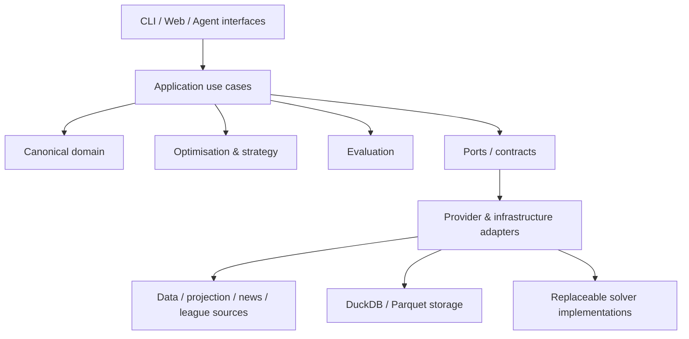

# FPL Decision Engine

An open-source, local-first decision-support engine for Fantasy Premier League.

The project combines player projections, optimisation, multi-gameweek planning and rival-aware strategy to support better FPL decisions while keeping forecasting, strategy and decision logic independently replaceable.

> **Status:** Early development. The canonical domain model and provider/optimisation contracts are implemented on `develop`. Data ingestion, persistence, projection integration and optimisation are the next vertical slices. `main` remains the stable/releasable branch.

## Philosophy

> **Models forecast. Optimisers decide. Agents explain and interrogate.**

The engine deliberately separates four questions:

| Question | Layer |
| --- | --- |
| What might happen? | Forecast |
| What do I value? | Strategy |
| What action best satisfies that objective? | Optimiser |
| Why is that the recommendation? | Agent / interface |

This separation lets the same forecasts support different objectives later, such as maximising expected points, protecting a mini-league lead or deliberately seeking useful variance when chasing.

The project is a **decision-support system**, not an automatic transfer bot. Human approval remains outside the optimisation engine.

## Architecture

Dependencies point inward. External providers and open-source projects map into contracts owned by this repository; their schemas do not become the project's domain model.



The intended analytical flow is:

```text
Source evidence
    ↓
Provider adapters
    ↓
Canonical players / teams / fixtures / manager state
    +
Canonical projections
    ↓
Strategy objective
    ↓
Optimiser
    ↓
Recommendation
    ↓
Evaluation / explanation
```

### Architectural rules

- The domain layer has no HTTP, database, dataframe or LLM dependencies.
- Provider-specific identifiers are kept separate from stable internal identifiers.
- Provider capabilities, provenance, freshness and failures are explicit.
- External projects sit behind adapters; they do not dictate core types.
- Source evidence and decision runs are designed to be reproducible.
- LLM/agent components may explain or interrogate analytical outputs but do not perform hidden arithmetic or directly mutate forecasts.

Architecture decisions are recorded under [`docs/adr`](docs/adr).

## Implemented today

On `develop` the project currently includes:

- Python 3.12 / `uv` project foundation;
- strict Ruff, Pyright and pytest CI;
- immutable canonical domain models for players, teams, gameweeks, fixtures, projections, squads, manager state, transfers, leagues and decision runs;
- core FPL invariants such as squad composition and club limits;
- provider contracts for core data, manager state, leagues, projections and news/evidence;
- replaceable optimisation-engine contracts;
- provider capability metadata, provenance/freshness envelopes and machine-readable error semantics;
- reusable provider contract-test helpers;
- ADRs and enforced issue-numbered branch naming.

The repository does **not** yet contain a live data-ingestion implementation, persisted analytical datasets, a production projection provider or an operational optimiser. Those are tracked as issues rather than presented here as finished features.

## Roadmap

Work is being delivered as vertical slices through GitHub Issues. The near-term sequence is:

1. **#18** — validate current FPL data sources, access model and usage constraints;
2. **#3** — implement offline-first FPL-shaped snapshot ingestion;
3. **#4** — add DuckDB/Parquet persistence and reproducible run provenance;
4. **#5** — integrate the first projection providers behind the canonical interface;
5. **#6** — build the single-gameweek squad, lineup and captain optimiser;
6. **#7** — add manager state, selling prices and transfer optimisation;
7. **#8 onward** — multi-gameweek planning, rival intelligence, news, chip strategy, backtesting and agent interfaces.

The issue backlog is the source of truth for planned work; the README intentionally avoids duplicating detailed acceptance criteria.

## Local development

Requirements:

- Python 3.12+
- [`uv`](https://docs.astral.sh/uv/)

Install and validate the current codebase:

```bash
uv sync --all-groups
uv run fpl --help
uv run ruff check .
uv run pyright
uv run pytest
```

The commands above are executable against the current repository. Feature-specific commands such as `fpl sync` will be documented only when their implementation lands.

## Branch and contribution model

- `main` — stable/releasable code only;
- `develop` — integration branch for the next coherent release;
- short-lived work branches are created from `develop` and merged back through pull requests;
- feature/fix branches must follow `<type>/<issue-number>-<short-description>`, for example:
  - `feature/3-fpl-data-ingestion`
  - `fix/27-selling-price`
  - `docs/19-readme-architecture`

CI enforces issue-numbered branch names for pull requests targeting `develop`.

See [`CONTRIBUTING.md`](CONTRIBUTING.md) for the current contribution rules.

## Data, credentials and third-party sources

This is an open-source code repository, not a redistribution repository for third-party datasets.

Do not commit:

- credentials, tokens, cookies or authenticated sessions;
- personal manager or mini-league state;
- local DuckDB databases or generated Parquet datasets;
- live provider snapshots that are not explicitly licensed for redistribution;
- Premier League/FPL logos, player imagery or other protected media.

CI uses small synthetic fixtures. Local source snapshots and analytical state belong under ignored data/state paths.

Third-party integrations must record their upstream source, licence, version/commit, purpose and upgrade strategy. See [`THIRD_PARTY_NOTICES.md`](THIRD_PARTY_NOTICES.md) and the ADRs for the current policy.

## Project scope

The long-term target is more than a one-gameweek expected-points selector. The architecture is intended to support:

- player projection ensembles and uncertainty;
- legal squad, lineup, captain and transfer optimisation;
- multi-gameweek planning and transfer optionality;
- chip strategy;
- mini-league/rival-aware objectives;
- news and availability evidence;
- reproducible simulation and backtesting;
- decision-regret analysis;
- conversational explanation over deterministic analytical tools.

These capabilities will be added incrementally behind stable contracts rather than as one tightly coupled application.

## Disclaimer

This is an unofficial project and is not affiliated with, endorsed by or associated with the Premier League or Fantasy Premier League. Users are responsible for ensuring that any external data source they configure is accessed and used in accordance with its applicable terms and licence.

## Licence

MIT. See [`LICENSE`](LICENSE).
